# Firebase CRUD

- [Firebase CRUD](#firebase-crud)
  - [Development server](#development-server)
  - [Code scaffolding](#code-scaffolding)
  - [Build](#build)
  - [Running unit tests](#running-unit-tests)
  - [Running end-to-end tests](#running-end-to-end-tests)
  - [Further help](#further-help)
  - [Instalación de Firebase](#instalaci%c3%b3n-de-firebase)
  - [Agregar Bootstrap a la aplicación](#agregar-bootstrap-a-la-aplicaci%c3%b3n)
  - [Instalar font Awesome](#instalar-font-awesome)
  - [Colecciones en AngularFirestore](#colecciones-en-angularfirestore)
    - [Usando AngularFirestoreCollection](#usando-angularfirestorecollection)
    - [snapshotChanges](#snapshotchanges)
    - [Agregar nuevas colecciones a Firebase](#agregar-nuevas-colecciones-a-firebase)
    - [Eliminar un item](#eliminar-un-item)
    - [Editar item](#editar-item)
  - [Simulación](#simulaci%c3%b3n)
    - [Agregar item](#agregar-item)
    - [Modificar item](#modificar-item)
    - [Eliminar item](#eliminar-item)
    - [Simulación completa](#simulaci%c3%b3n-completa)


Este proyecto fue generado con [Angular CLI](https://github.com/angular/angular-cli) version 9.1.5.


## Instalación de Firebase

Instalaremos Firebase siguiendo su documentación de [github](https://github.com/angular/angularfire/blob/master/docs/install-and-setup.md)

1. Crear un nuevo proyecto.
```console
npm install -g @angular/cli
ng new <project-name>
cd <project-name>
```

2. Agregar la configuración de Firebase a la variable de _environments_.
Abrir _/src/environments/environment.ts_ y añadir tu configuración de Firebase. Entrar a la [Consola de Firebase](https://console.firebase.google.com/) con una cuenta de gmail, click en _agregar un nuevo proyecto_. Click en __Agregar Firebase a tu app web__. Entonces colocalas un nombre para el proyecto y copias la configuración que te otorga del proyecto.

```Typescript
export const environment = {
  production: false,
  firebase: {
    apiKey: '<your-key>',
    authDomain: '<your-project-authdomain>',
    databaseURL: '<your-database-URL>',
    projectId: '<your-project-id>',
    storageBucket: '<your-storage-bucket>',
    messagingSenderId: '<your-messaging-sender-id>'
  }
};
```


3. Instalar AngularFire y Firebase

```console
ng add @angular/fire@next
```
Instalar AngularFire y Firebase desde npm:

```console
npm install
```

Es posible que obtengamos la siguiente salida:

```console
npm WARN @angular/fire@6.0.0-rc.2 requires a peer of firebase@^7.8.0 but none is installed. You
must install peer dependencies yourself.
```
Tendremos que instalar firebase. Entonces, en el archivo _package.json_ dentro de dependencias colocamos la siguiente línea:

```json
"dependencies": {
    "firebase": "^7.8.0"
```
Y lo instalamos con:
```console
npm install
```

Esto instalará los paquetes para las herramientas vía npm. Te pedirá un código de autorización, esto se obtiene cuando es este proceso se abre tu cuenta de google en el navegador y pidiendo acceso a la conexión con Firebase. Además, debes elegir tu proyecto creado en el paso 2.


4. Configurar @NgModule para el módulo _AngularFireModule_.
Abrir _/src/app/app.module.ts_, importar el proveedor de Firebase, y especificar tu configuración de Firebase. Agregar las siguientes líneas.

```Typescript
import { AngularFireModule } from '@angular/fire';
import { environment } from '../environments/environment';

@NgModule({
  declarations: [
    AppComponent
  ],
  imports: [
    BrowserModule,
    AppRoutingModule,
    AngularFireModule.initializeApp(environment.firebase)
  ],
  //...
```

5. Configurar los _@NgModule_ individuales. Tú puedes agregar las que necesites. Sin embargo, en esta ocasión importaremos todas las posibles. Agregamos las dos restantes.

```Typescript
import { AngularFireAnalyticsModule } from '@angular/fire/analytics';
import { AngularFirestoreModule } from '@angular/fire/firestore';

@NgModule({
  imports: [
    BrowserModule,
    AppRoutingModule,
    AngularFireModule.initializeApp(environment.firebase),
    AngularFireAnalyticsModule,
    AngularFirestoreModule
  ],
  //...
```
6. Iniciar el servidor.

```console
ng serve
```
7. Injectar AngularFirestore

Abrir _/src/app/app.component.ts_, y agregar _AngularFirestore_ como se indica.

```Typescript
import { Component } from '@angular/core';
import { AngularFirestore } from '@angular/fire/firestore';

@Component({
  selector: 'app-root',
  templateUrl: 'app.component.html',
  styleUrls: ['app.component.css']
})
export class AppComponent {
  constructor(firestore: AngularFirestore) {

  }
}
```

8. Enlazar una colección Firestore a una lista, _Observable_.

En _/src/app/app.component.ts_:

```Typescript
import { Component } from '@angular/core';
import { AngularFirestore } from '@angular/fire/firestore';
import { Observable } from 'rxjs';

@Component({
  selector: 'app-root',
  templateUrl: 'app.component.html',
  styleUrls: ['app.component.css']
})
export class AppComponent {
  items: Observable<any[]>;
  constructor(firestore: AngularFirestore) {
    this.items = firestore.collection('items').valueChanges();
  }
}
```

9. Ir a la consola de Firebase, dentro de nuestro proyecto. En desarrollo seleccionar _Database_.

<p align="center">
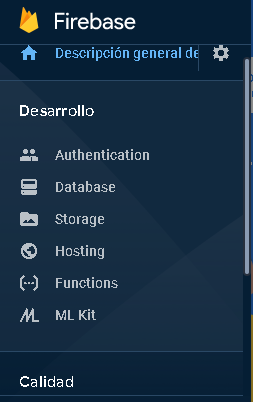
</p>

10. Seleccionar _Crear base de datos_ con Cloud Firestore.

<p align="center">

</p>

11. Escogeremos _Comenzar en modo prueba_ para que todos puedan leer y escribir en la base de datos. Esto será durante 30 días.

<p align="center">
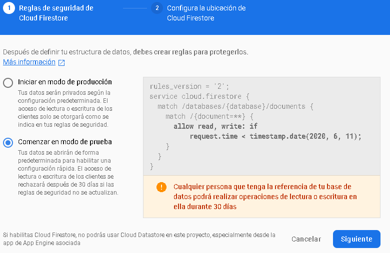
</p>

12. Seleccionar una ubicación.

<p align="center">
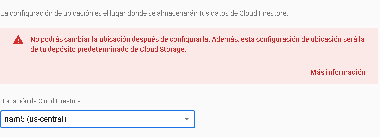
</p>

13. Click en Iniciar colección y dar un nombre a la colección. Asignaremos el mismo nombre que colocamos en _app.component.ts_, __items__.

<p align="center">
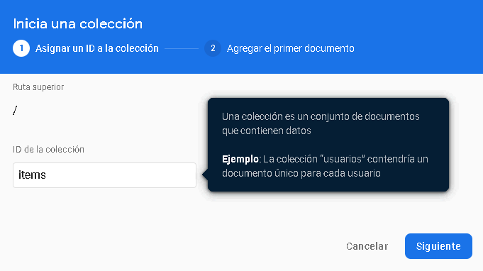
</p>

14. Crear un campo para la colección.

<p align="center">
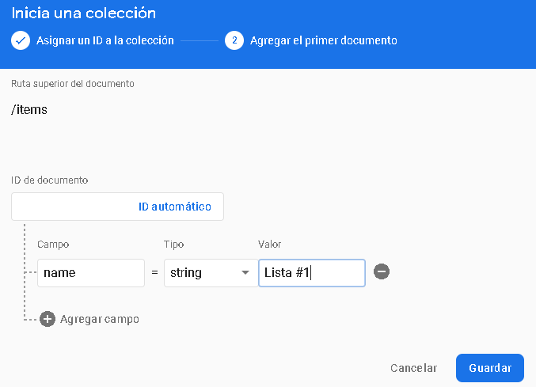
</p>

15. Observamos la colección creada, agregaremos un nuevo documento, click en _Agregar documento_.

<p align="center">
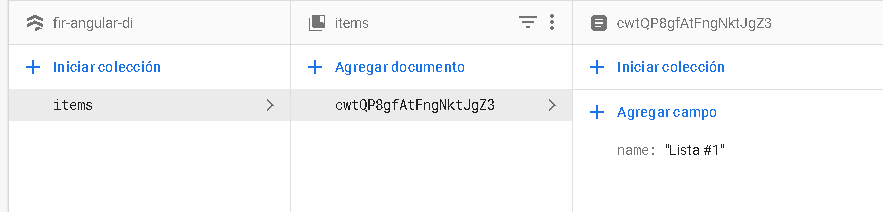
</p>
</br>
<p align="center">
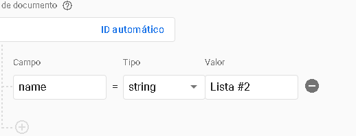
</p>

16. Abrir _/src/app/app.component.html_ y agregar los elementos de la colección con:

```html
<ul>
  <li class="text" *ngFor="let item of items | async">
    {{item.name}}
  </li>
</ul>
```

17. Abrir el servidor _localhost:4200_, y observamos los elementos de la base de datos de Firebase.

<p align="center">
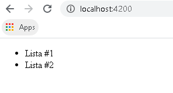
</p>

Se puede desplegar la aplicación al hosting de Firebase con _ng deploy_, sin embargo, no lo haremos.

## Agregar Bootstrap a la aplicación

1. Ir al [sitio oficial](https://getbootstrap.com/) y copiar el link de CSS dentro de la etiqueta _head_ del archivo __index.html__, además copiamos lo de javaScript al final de la etiqueta _body_.

```html
<head>

<!-- CSS only -->
<link rel="stylesheet" href="https://stackpath.bootstrapcdn.com/bootstrap/4.5.0/css/bootstrap.min.css" integrity="sha384-9aIt2nRpC12Uk9gS9baDl411NQApFmC26EwAOH8WgZl5MYYxFfc+NcPb1dKGj7Sk" crossorigin="anonymous">
</head>

<body>


 <!-- JS, Popper.js, and jQuery -->
<script src="https://code.jquery.com/jquery-3.5.1.slim.min.js" integrity="sha384-DfXdz2htPH0lsSSs5nCTpuj/zy4C+OGpamoFVy38MVBnE+IbbVYUew+OrCXaRkfj" crossorigin="anonymous"></script>
<script src="https://cdn.jsdelivr.net/npm/popper.js@1.16.0/dist/umd/popper.min.js" integrity="sha384-Q6E9RHvbIyZFJoft+2mJbHaEWldlvI9IOYy5n3zV9zzTtmI3UksdQRVvoxMfooAo" crossorigin="anonymous"></script>
<script src="https://stackpath.bootstrapcdn.com/bootstrap/4.5.0/js/bootstrap.min.js" integrity="sha384-OgVRvuATP1z7JjHLkuOU7Xw704+h835Lr+6QL9UvYjZE3Ipu6Tp75j7Bh/kR0JKI" crossorigin="anonymous"></script>
</body>

```

## Instalar font Awesome
Nos permite trabajar con íconos de una manera ágil. 
1. Ir su [sitio oficial](https://fontawesome.com/), luego click en start.
2. Ingresar un correo electrónico y verificarlo. Rellenar los datos.   
3. Click en _View all kits_.

<p align="center">
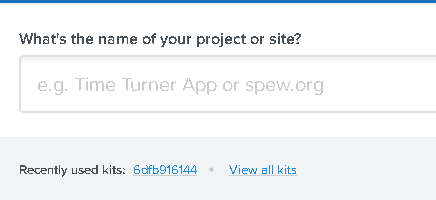
</p>

4. Dar click en el kit que aparece.
5. Copiar el código del kit.
6. En el _index.html_ dentro de la etiqueta _head_ pegar el código.

## Colecciones en AngularFirestore

Revisaremos lo documentación de angularfire con respecto a la [Colección en AngularFirestore](https://github.com/angular/angularfire/blob/master/docs/firestore/collections.md)

Cloud Firestore es una NoSQL, base de datos orientada a documentos. Diferente a la base de datos SQL, no hay tablas o filas. Por lo contrario, almacenas datos en _documentos_, los cuales son organizados dentro de _colecciones_. Cada _documento_ contiene un conjunto de pares de _clave-valor_. Cloud Firestore es optimizado para almacenar largas colecciones de pequeños documentos.

### Usando AngularFirestoreCollection

AngularFirestoreCollection es un servicio genérico que proporciona con un conjunto fuertemente tipado de métodos para manipular y transmitir datos. Este servicio es diseñado para ser usado como un _@Injectable()_.

1. Abrir una nueva terminal e ir a la carpeta raíz del proyecto.
2. Crear un nuevo servicio.

```console
no g service services/conexion
```
Esto crea dentro de una carpeta llamada _services_ el archivo _conexion.service.ts_ que usaremos a continuación.

3. En _app.module.ts_ importar el servicio creado.

```Typescript
import { ConexionService } from './services/conexion.service';

providers: [
    ConexionService
  ],
```
4. Crearemos un componente para la lista que mostraremos.
```console
no g c components/lista
no g c components/listaAdd
```

Esto creará una carpeta _components_
que incluye dos componentes _lista_ y _listaAdd_.

5. Modificamos el compomente de lista, _lista.component.html_.

```html
    <ul>
      <li class="text" *ngFor="let item of items | async">
        {{item.name}}
      </li>
    </ul>
```
6. Modificamos _app.component.html_.
```html
    
<div class="container">
  <div class="row">
    <div class="col-md-6">
      <app-lista></app-lista>
    </div>
    <div class="col-md-6">
      <app-lista-add></app-lista-add>
    </div>
  </div>
</div>
```
7. En el servicio creado _conexion.service.ts_ importamos el _AngularFirestore_ y el _Observable_.

```Typescript
import { AngularFirestore, AngularFirestoreCollection } from '@angular/fire/firestore';
import { Observable } from 'rxjs';
```

8. En el mismo archivo creamos una _interface_ que nos permite designar un objeto y sus características.
```Typescript
export interface Item { name: string; }
```
9. Además, necesitamos crear un arreglo _itemCollection_ del tipo _AngularFirestoreCollection_ que será de tipo _Item_, es decir usará la interfaz anterior.

```Typescript
 private itemsCollection: AngularFirestoreCollection<Item>;
  items: Observable<Item[]>;
  constructor(private afs: AngularFirestore) {
    this.itemsCollection = afs.collection<Item>('items');
    this.items = this.itemsCollection.valueChanges();
  }
  addItem(item: Item) {
    this.itemsCollection.add(item);
  }
  listaItem(){
    return this.items;
  }
```
Este proceso crea un arreglo del tipo _Item_ con clave-valor: _name:string_, que colecciona todos los elementos de la colección de firebase llamada __items__, con el método _listaItem()_ retornamos todos estos elementos.

10. Mostraremos esta lista obtenida de Firebase en el componente de lista, entonces, importamos en _lista.component.ts_ el servicio que usaremos.

```Typescript
import { ConexionService } from 'src/app/services/conexion.service';
```
11. Creamos una lista que almacenará los items, dentro del contructor agregamos los items a través del servicio _conexión_ y su método _listaItem_.

```Typescript
items:any;

  constructor( private conexion:ConexionService) { 
    this.conexion.listaItem().subscribe(item=>{
      this.items = item;
    })
  }
```
12. Modificaremos _lista.component.html_, haremos uso de un componente _Alerts_ de _Bootstrap_.

```html
<div class="alert alert-warning my-2" role="alert" *ngFor="let item of items">
  {{item.name}}
</div>
```
<p align="center">
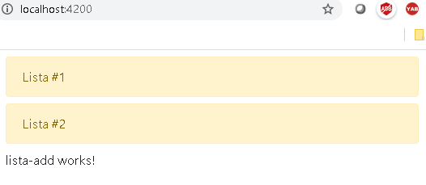
</p>

### snapshotChanges

Es el estado actual de tu colección. Retorna un _Observable_ de datos como un arreglo sincronizado. Deberíamos usar _snapshotChanges_ cuando necesitamos una lista de datos pero también queremos mantenernos alrededor de los metadatos. Los metadatos proporcionan _DocumentReference_, id del documento, e index de arreglo de el documento simple. Tener el id de documentos hace más fácil usar métodos de manipulación de datos. Este método te brinda más potencia con otras integraciones de Angular como ngrx, formularios y animaciones debido a la propiedad type. La propiedad type en cada _DocumentChangeAction_ es útil para reductores ngrx, estados de formulario y estados de animación.

Por lo tanto, es necesario obtener el _id_ de los items, con _snapshotChanges_ podremos obtenerlos. Esto modificará el servicio de _conexión_, se usará _snapshotChanges_ en vez de _valueChanges_.
Entonces, el constructor de _conexion.service.ts_ quedaría de la siguiente manera. 

```Typescript 
//importar map
import { map } from 'rxjs/operators';
//...

constructor(
    private afs: AngularFirestore
  ) { 
    this.itemsCollection = afs.collection<Item>('items');
    this.items = this.itemsCollection.snapshotChanges().pipe(
      map(actions => actions.map(a => {
        const data = a.payload.doc.data() as Item;
        const id = a.payload.doc.id;
        return { id, ...data };
      }))
    );
  }
```

Para comprobar que efectivamente se está importando el _id_ modificamos _lista.component.html_.

```html
<div class="alert alert-warning my-2" role="alert" *ngFor="let item of items">
  {{item.name}} - {{item.id}}
</div>
```
Se observa en el navegador que se ha obtenido correctamente el _id_ de cada elemento.

<p align="center">
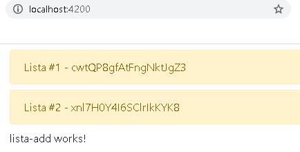
</p>


### Agregar nuevas colecciones a Firebase

1. Hacemos uso del método previamente creado en _conexion.service.ts_, _addItem(item: Item)_, que agrega el _item_ recibido a nuestra base de datos de Firebase.

```Typescript
addItem(item: Item) {
    this.itemsCollection.add(item);
  }
```
2. El formulario lo haremos en el componente _lista-add_, entonces, en _lista-add.component.ts_ importamos el servicio _conexion_, y crear un objeto _item_.

```Typescript
import { ConexionService } from 'src/app/services/conexion.service';

item:any = {
    name:''
  }
```
3. Crearemos el formulario para este componente en _lista-add.component.html_. En la etiqueta _input_ a través del atributo _name_ enviaremos los datos que llenarán al objeto _item_ creado en el anterior paso.

```html
<form (ngSubmit)="agregar()">
    <input 
    type="text" placeholder="Ingresa el nombre" 
    name="name" class="form-control"
    [(ngModel)]="item.name"
    >
    <button class="btn btn-warning mt-2" type="submit">Agregar</button>
</form>
```

Además, hemos hecho uso de _(ngSubmit)="agregar()"_ y luego el uso de _ngModel_ que asigna a la propiedad _name_  del objeto _item_ el valor _name_ correspondiente a este _input_.

4. En _lista-add.component.ts_ crearemos la función _agregar_ que se ejecuta al hacer click en el botón _Agregar_.

```Typescript
agregar(){
    this.service.addItem(this.item);
  }
```

Esto hace uso del método _addItem_ del servicio _conexion_ y envía el _item_ obtenido a través de _ngModel_ del formulario.

5. Actualizamos la función _agregar_ para limpiar los campos del item luego de enviar el item a Firebase.

```Typescript
agregar(){
    this.service.addItem(this.item);
    this.item.name=''; //limpiar campo
  }
```
6. Para hacer uso de _ngModel_ es necesario importar el módulo de _FormsModule_ en _app.module.ts_ y agregar dentro de _imports_

```Typescript
import { FormsModule }   from '@angular/forms';

imports: [    
    FormsModule,
    //... otros Módulos

```
7. En el navegador al agregar un nuevo elemento se puede comprobar que efectivamente se ha agregado un nuevo item.

<p align="center">
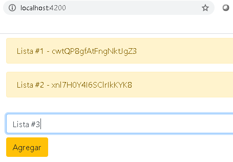
</p>

</br>

<p align="center">
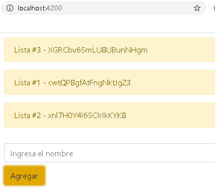
</p>

### Eliminar un item

1. Anteriormente, instalamos _Font Awesome_, por lo tanto, nos iremos a su web oficial y dentro del apartado de [Iconos](https://fontawesome.com/icons?d=gallery&m=free) buscamos _delete_ y seleccionamos el que deseamos usar.

<p align="center">
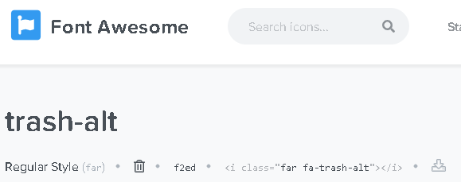
</p>

2. He seleccionado _trash-alt_, copiamos el código en html del ícono que se observa en la imagen anterior haciendo click sobre este.
   
3. Abrimos _lista.component.html_ y lo pegamos dentro de este. Además, usamos la clase _float-right_ para que el ícono este al lado derecho.

```html
<div class="alert alert-warning" role="alert" *ngFor="let item of items">
  {{item.name}} - {{item.id}} 
  <div class="float-right">
    <i class="far fa-trash-alt"></i>
  </div>
</div>
```
<p align="center">
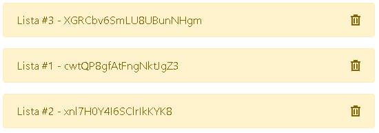
</p>

4. Agregamos el evento click, con una función _eliminar_ y como parámetro pasamos _item_ que es el elemento que deseamos eliminar.

```html
<div class="alert alert-warning" role="alert" *ngFor="let item of items">
  {{item.name}} - {{item.id}} 
  <div class="float-right" (click)="eliminar(item)">
    <i class="far fa-trash-alt"></i>
  </div>
</div>
```

5. En _lista.component.ts_ creamos la función de _eliminar_.

```Typescript
 eliminarItem(item){
    
  }
```

6. El item que se quiere eliminar se debe enviar a nuestro servicio, entonces en _conexion.service.ts_ agregamos el método.

La maniúlación individual de documentos no se hace a través de colecciones sino de documentos como se explica en la documentación [github de angularfire](https://github.com/angular/angularfire/blob/master/docs/firestore/documents.md).
Entonces, creamos una variable _itemDoc_ de tipo _AngularFirestoreDocument<Item>_. Además de importar _AngularFirestoreDocument_

```Typescript
import { AngularFirestore, AngularFirestoreCollection, AngularFirestoreDocument } from '@angular/fire/firestore';

export class ConexionService {
  private itemDoc: AngularFirestoreDocument<Item>;
  //

}

eliminarItem(item){
    this.itemDoc = this.afs.doc<Item>(`items/${item.id}`);
    this.itemDoc.delete();
  }

```

La función _eliminarItem(item)_ recibe un item, luego hace uso de _itemDoc_ que almacenará el item recibido con un _id_ específico, esto lo busca dentro de la colección _items_. Finalmente, lo elimina con el método _delete()_.

7. Actualizamos el método _eliminar_ de _lista.component.ts_

```Typescript
eliminar(item){
    this.conexion.eliminarItem(item);
  }
```
8. Eliminamos la Lista # 2.

<p align="center">
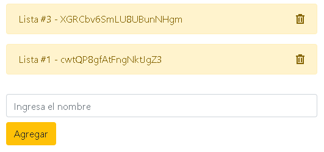
</p>

Efectivamente se ha eliminado la Lista #2 de Firebase.

### Editar item

1. Iremos a la web oficial de _Font Awesome_ y dentro del apartado de [Iconos](https://fontawesome.com/icons?d=gallery&m=free) buscamos _delete_ y copiamos su código html.

2. Abrimos _lista.component.html_ y lo pegamos dentro de este. Similarmente a como lo hicimos con el anterior ícono _trash-alt_. También, colocamos el método _editar_ que se efectuará al hacer click sobre este.

```html
<div class="alert alert-warning" role="alert" *ngFor="let item of items">
  {{item.name}} - {{item.id}} 
  <div class="float-right" (click)="eliminar(item)">
    <i class="far fa-trash-alt"></i>
  </div>
  <div class="float-right mr-2" (click)="editar(item)">
    <i class="fas fa-pencil-alt"></i>
  </div>
</div>
```

<p align="center">
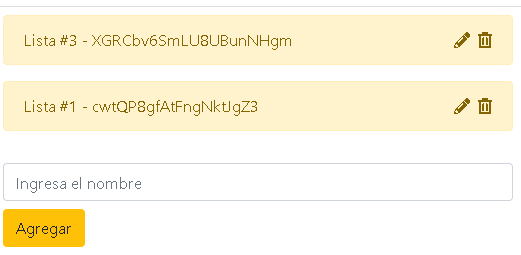
</p>

3. En _lista.component.ts_ agregaremos el método de editar.

```Typescript
editar(item){
    
  }
```

4. Abriremos una ventana donde podremos editar dicho campo. Usaremos _Bootstrap_, iremos a [Modal](https://getbootstrap.com/docs/4.5/components/modal/), copiaremos todo lo que corresponde al modal y pegaremos en el archivo _lista.component.html_. Además, en el botón de editar debemos agregar los atributos _data-toggle="modal" data-target="#exampleModal"_

```Typescript
<!-- Modal -->
<div class="modal fade" id="exampleModal" tabindex="-1" role="dialog" aria-labelledby="exampleModalLabel" aria-hidden="true">
  <div class="modal-dialog">
    <div class="modal-content">
      <div class="modal-header">
        <h5 class="modal-title" id="exampleModalLabel">Modal title</h5>
        <button type="button" class="close" data-dismiss="modal" aria-label="Close">
          <span aria-hidden="true">&times;</span>
        </button>
      </div>
      <div class="modal-body">
        ...
      </div>
      <div class="modal-footer">
        <button type="button" class="btn btn-secondary" data-dismiss="modal">Close</button>
      </div>
    </div>
  </div>
</div>
```
5. Dentro de _<div class="modal-body">_ es donde tendremos el formulario para modificar, entonces, copia el formulario de _lista-add.component.html_

6. En _lista.component.ts_ creamos _editarItem_ para que almacene el dato a editar. Modificamos el método _editar_ para que almacene el item que deseamos modificar en el objeto antes creado _editarItem_.

```Typescript
editarItem:any = {
    name:''
}

editar(item){
    this.editarItem = item;
  }
```
7. Modificamos la sección del Model, ya que _[(ngModel)]_ será el item que estamos almacenando _"editarItem.name"_. Colocamos el nombre del método que se efectuará al finalizar el formulario _agregarItemEditado()_.
8. 
```html
<div class="modal-body">
        <form (ngSubmit)="agregarItemEditado()">
          <input 
          type="text" placeholder="Editar el nombre" 
          name="name" class="form-control"
          [(ngModel)]="editarItem.name"
          >
          <button class="btn btn-warning mt-2" type="submit">Editar</button>
      </form>
      </div>
```

8. En _conexion.service.ts_ creamos el metodo para editar el item, igual como hicimos con eliminar.

```Typescript
editarItem(item){
    this.itemDoc = this.afs.doc<Item>(`items/${item.id}`);
    this.itemDoc.update(item);
  }
```
9. En _lista.component.ts_ creamos el método __agregarItemEditado()_

```Typescript
    agregarItemEditado(){
    this.conexion.editarItem(this.editarItem);
  }
```

10. En la interfaz web precionamos sobre uno de los items a editar. 
 
<p align="center">
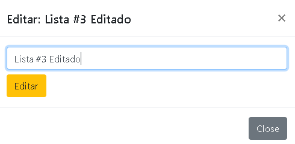
</p>

11. Hacemos click en Editar y luego en Close.

<p align="center">
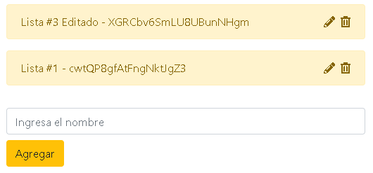
</p>

Observamos que efectivamente se ha editado.

## Simulación

### Agregar item

<p align="center">
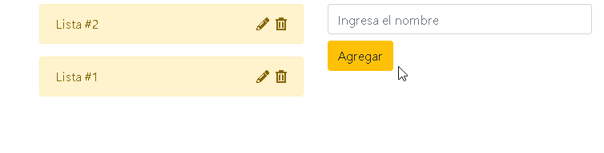
</p>
</br>
<p align="center">
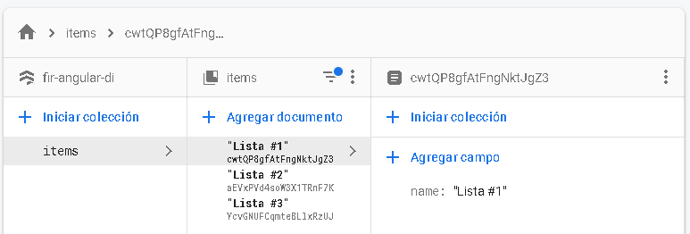
</p>

### Modificar item

<p align="center">
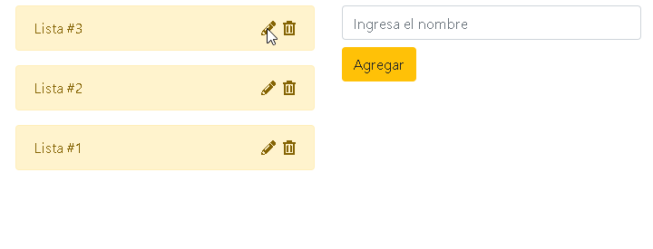
</p>
</br>
<p align="center">
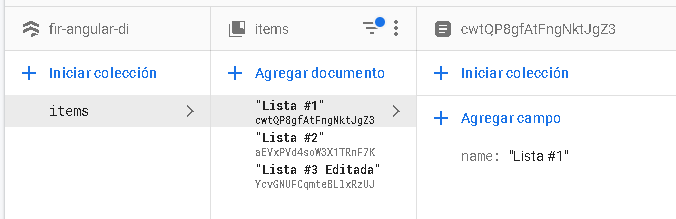
</p>

### Eliminar item

<p align="center">
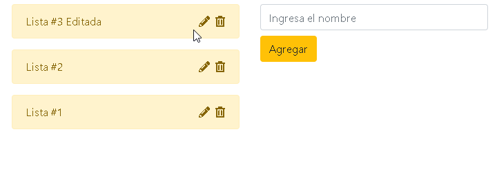
</p>
</br>
<p align="center">
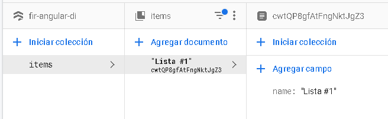
</p>

### Simulación completa

<p align="center">
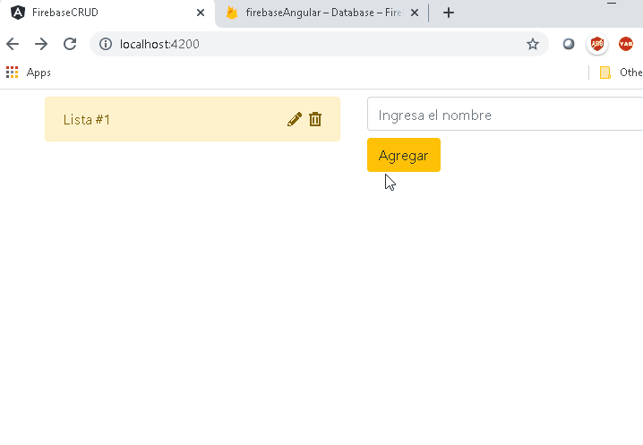
</p>


